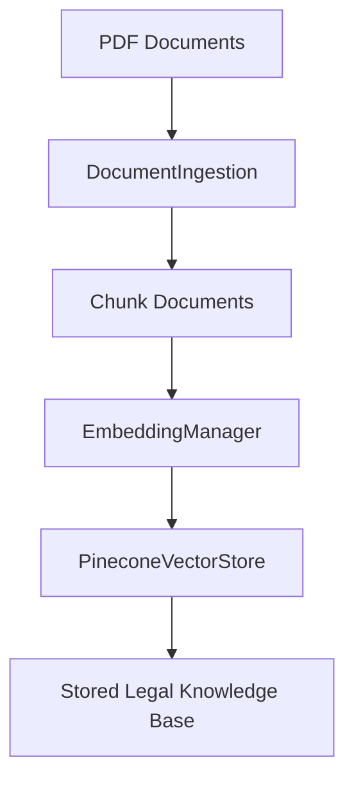
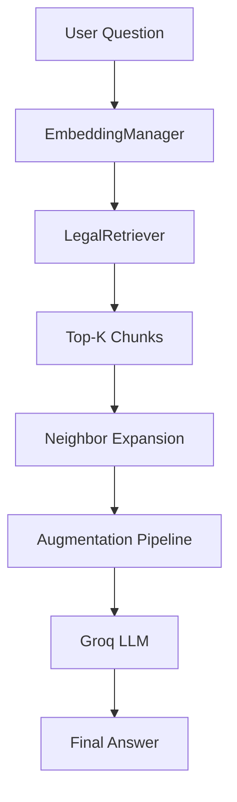

# ⚖️ Jurify RAG Pipeline Architecture

A legal Retrieval-Augmented Generation (RAG) system built using:

* **LangChain** for document processing
* **BAAI/bge-small-en-v1.5** for embeddings
* **Pinecone** for vector storage
* **Groq LLMs** for answer generation
* **Python** for orchestration

---

# 📂 Project Structure

```text
python-services/
│
├── embedding/
│   ├── __init__.py
│   └── embedding_manager.py
│
├── ingestion/
│   ├── __init__.py
│   ├── ingestion.py
│   └── legal_document_chunking_plan.md
│
├── vector_store/
│   ├── __init__.py
│   ├── vector_store.py
│   └── README.md
│
├── pipelines/
│   ├── retrieval.py
│   ├── augmentation.py
│   ├── groq_llm.py
│   ├── query_pipeline.py
│   ├── rag_execute.py
│   └── README.md
│
├── kaggle_dataset/
│   ├── docum.pdf
│   ├── legaldoc.pdf
│   └── kaggle_law_dataset.csv
│
└── query_test.py
```

---

# 🟩 Ingestion Pipeline

The ingestion pipeline is responsible for processing legal documents and storing them in Pinecone.

```text
PDF Documents
      │
      ▼
Document Loader
      │
      ▼
Chunking Strategy
      │
      ▼
Embedding Generation
      │
      ▼
Pinecone Vector Store
```

## Components

### ingestion/

Responsible for:

* Loading PDFs
* Extracting text
* Chunking documents
* Preserving metadata

### embedding/

Responsible for:

* Loading embedding model
* Generating document embeddings
* Generating query embeddings

### vector_store/

Responsible for:

* Creating Pinecone index
* Uploading vectors
* Metadata storage
* Fetching vectors by ID

### rag_execute.py

Main ingestion entrypoint.

```text
Load PDFs
    ↓
Chunk Documents
    ↓
Generate Embeddings
    ↓
Store in Pinecone
```

---

## 🟩 Ingestion Flow



---

# 🟪 Query Pipeline

The query pipeline runs whenever a user asks a legal question.

```text
User Question
      │
      ▼
Query Embedding
      │
      ▼
Semantic Retrieval
      │
      ▼
Neighbor Expansion
      │
      ▼
Prompt Augmentation
      │
      ▼
Groq LLM
      │
      ▼
Final Answer
```

---

## Components

### retrieval.py

Responsible for:

* Semantic Search
* Similarity Scoring
* Threshold Filtering
* Metadata Filtering
* Neighbor Expansion

Example:

```text
Query:
"What documents are required for a Lease Deed?"

↓

Retrieve Top-K Chunks

↓

Retrieve Adjacent Chunks

↓

Return Relevant Context
```

---

### augmentation.py

Responsible for:

* Building LLM prompts
* Injecting retrieved context
* Grounding answers in legal documents

Example:

```text
Retrieved Chunks
       +
User Question
       ↓
Prompt Construction
```

---

### groq_llm.py

Responsible for:

* Groq API communication
* LLM invocation
* Response generation

---

### query_pipeline.py

Acts as the orchestration layer.

```text
User Query
      ↓
Retriever
      ↓
Augmenter
      ↓
Groq LLM
      ↓
Answer
```

---

## 🟪 Query Flow



---

# 🔄 Complete RAG Architecture

```text
                    INGESTION PIPELINE
                    ─────────────────

PDFs
 ↓
Chunking
 ↓
Embeddings
 ↓
Pinecone


                    QUERY PIPELINE
                    ──────────────

User Question
 ↓
Query Embedding
 ↓
Pinecone Search
 ↓
Retrieved Chunks
 ↓
Neighbor Expansion
 ↓
Prompt Augmentation
 ↓
Groq LLM
 ↓
Final Answer
```

---

# 🎯 Current Progress

## Ingestion

* [x] PDF Loading
* [x] Chunking
* [x] Embedding Generation
* [x] Pinecone Storage

## Retrieval

* [x] Semantic Search
* [x] Similarity Thresholding
* [x] Metadata Filters
* [x] Neighbor Expansion

## Generation

* [ ] Prompt Augmentation
* [ ] Groq Integration
* [ ] End-to-End Query Pipeline

## Future Improvements

* [ ] Cross-Encoder Re-Ranking
* [ ] Deduplication
* [ ] Hybrid Search (Dense + Sparse)
* [ ] Query Expansion
* [ ] Source Citations
* [ ] Multi-Document Reasoning
* [ ] Legal Reference Attribution

---

# 📌 Design Principle

The architecture intentionally separates:

🟩 **Knowledge Creation (Ingestion Pipeline)**

from

🟪 **Knowledge Consumption (Query Pipeline)**

This allows documents to be embedded only once while supporting unlimited user queries efficiently.
